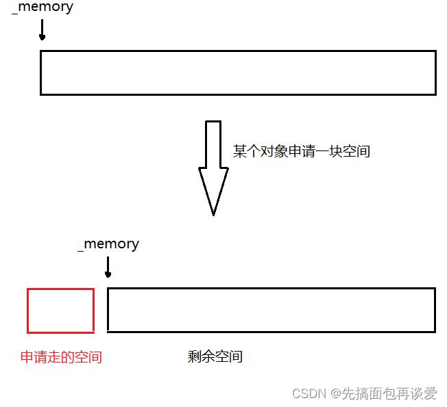
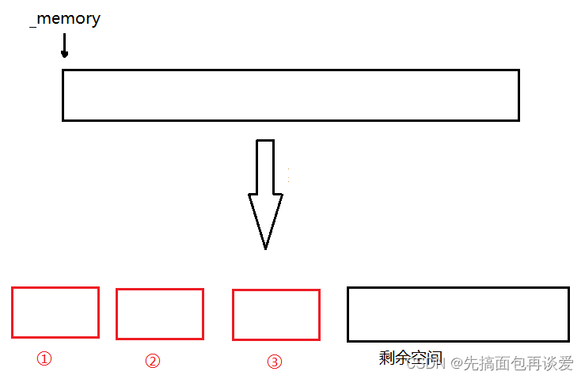
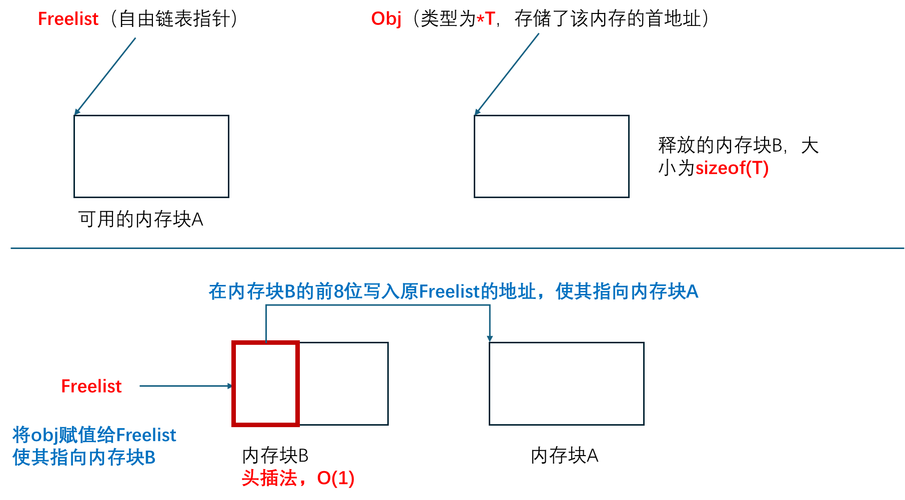
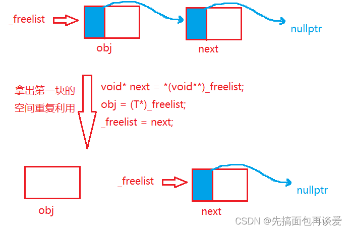
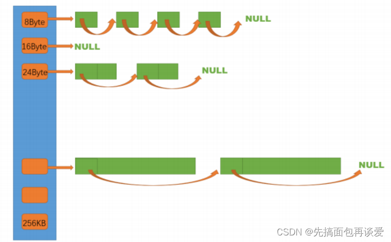

## ObjectPool

### 使用char*作为内存池的指针
`char* _memory = nullptr; `

这里不使用`void*`，将 `_memory` 定义为 `char*`，当需要移动 $n$ 个字节时，直接 `_memory += n` 即可，逻辑非常直观。


### 如何分配内存
```cpp
//将原本内存池首地址给obj，并将其转为T*指针
//即告诉编译器起始地址为_memory
//长度为sizeof(T)
obj = (T*)_memory; 
_memory += sizeof(T); //内存池指针移动
_remanenetBytes -= sizeof(T);//减少对应可用内存字节
```
指针的存储的是内存块的首地址，而指针的类型决定了编译器从首地址往后读取多少个字节。



### 自由链表回收内存
```cpp
void Delete(T* obj)
    { 
        /*        
        在obj指向的内存中，写入一个指针即_freelist
        问题在于obj指向的内存块存放的是T类型的，无法接受指针赋值
        因此这里将obj强制转换为**void(指针的指针)
        让编译器把 obj 指向的内存当作一个“存放指针的容器”
        */
        *(void**)obj = _freelist;
        _freelist = obj;
    }
```


### 从自由链表分配内存
```cpp
if(_freelist)
{
    //_freelist不为空则从这里那内存
    //采用头删
    //转为指针的指针再解引用，即以_freelist为首地址读取一个指针，
    //该指针指向的是下一个内存块，将其赋给void* next
    void* next = *(void**)_freelist; 
    obj = (T*)_freelist;
    _freelist = next;
}
```


### 定位new
```CPP
//除了分配空间，还得初始化
//定位new。详情见MD
new(obj)T;
```
普通的 new 会做两件事：1. 申请内存；2. 调用构造函数。
但在内存池中，内存是你提前申请好的，你只需要在已有的内存空间上初始化对象。
+ 语法:`new (指针) 类型`;

+ 作用:不分配内存，只在“指针”指向的地址处调用构造函数。

+ new(obj)T; 是完全正确的，它保证了 TreeNode 里的 _val 被设为 0，指针被设为 nullptr。


### 关于内存池（大内存块的释放）


```cpp
~ObjectPool()
{
    for (char* ptr : _M)
    {
        free(ptr);
    }
    
}
```
使用vector存放所有的内存池，`std::vector<char*> _M;`，`_M.push_back(_memory);`，在析构函数中循环释放


## Common
### SizeClass
```cpp
线程申请size的对齐规则：整体控制在最多10%左右的内碎片浪费
size范围				对齐数				对应哈希桶下标范围
[1,128]					8B 对齐      		freelist[0,16)
[128+1,1024]			16B 对齐  			freelist[16,72)
[1024+1,8*1024]			128B 对齐  			freelist[72,128)
[8*1024+1,64*1024]		1024B 对齐    		freelist[128,184)
[64*1024+1,256*1024]	8*1024B 对齐  		freelist[184,208)
```

实际上这里的对齐数可以理解为步长
在[1,128]这个分为内，每个桶的内存块大小为8，16，24……，按8B增长（因为要入指针，因此最小的是8B）
而在[128_1,1024]这个范围内，每个桶的内存块大小为128+16，128+32，128+48……，按16B增长



##ThreadCache
### TLS-线程局部存储
进程的全局变量是每个线程共享的，那有没有一种全局变量能让某个线程自己独有但是其他线程看不见呢？
答案是有的，就是TLS。
线程局部存储（TLS），是一种变量的存储方法，这个变量在它所在的线程内是全局可访问的，
但是不能被其他线程访问到，这样就保持了数据的线程独立性，避免了一些加锁操作，控制成本更低。
```cpp
static thread_local ThreadCache* pTLSThreadCache = nullptr;
```

## CenteralCache
### CenterCache数据结构


**CC与TC的相同点**
1. CC也是哈希桶，且映射规则与TC一致。这使得当TC某个桶没有空间时可以直接到CC对应小标的哈希桶拿空间

**CC与TC的不同点**
1. 锁：TC由于是TLS，各个线程各自独有，因此线程向TC要空间不产生数据竞争，不用枷锁；CC有“桶锁”，即各个桶有各自的锁，只有多个TC向CC的同一个桶索要空间时，才会发生竞争，需要加锁。

2. TC中自由链表挂的是一个个空间块。CC中挂在的是一个个SPAN。

#### SPAN
1. span管理的是以页（通常为4KB）为单位的大内存块，需要size_t _n去记录管理了多少页？
2. span管理的多个页会被划分为桶对应的字节大小空间，即每个span再挂载自由链表，需要void* _list指向链表头节点
TODO:为什么感觉这两个有点重复了？或者说1有点多余？

3. 每个桶下挂的span包含的页数不同，桶对应的字节数越大，页数越大，反之越小。由此，span还需要有个_pageID去记录当前span管理的是哪些页

4. span是双向链表，方便增删改查

5. span中还有size_t _usecount。这个_usecount是用来记录当前span分配出去了多少个块空间，分配一块给tc，对应就要`++use_count`，如果tc还回来了一块，那就`--use_count`。_usecount初始值为0。
当span中的use_count为0的时候可以将其还给pc以供pc拼接更大的页，用来解决内存碎片问题（外碎片）。


### 单例模式与Static
```cpp
static CentralCache* GetInstance()
{
    static CentralCache* _sInst;
    return _sInst;
}
```
单例模式已经很熟悉了，这里主要是对于Static的理解：

之前的理解：对局部变量使用static会延长它的寿命，静态局部变量在离开作用域后并不会消亡。

但问题在于代码多次执行到这里，怎么知道静态局部变量是不是已经被创建了？
实际上声明静态局部变量的时候，编译器会自行插入一段“检查-创建”的代码，若变量不存在则创建，若存在则跳过创建，且整个过程是线程安全的。