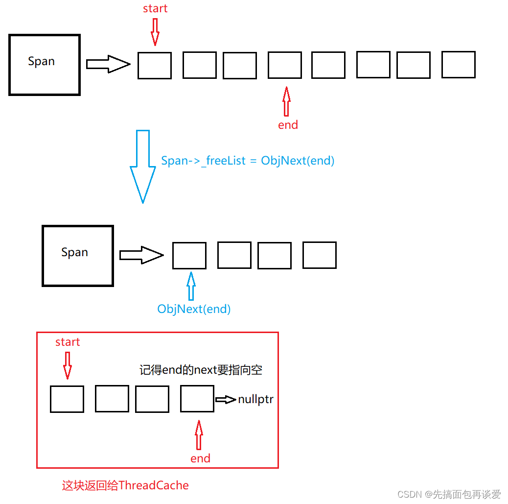
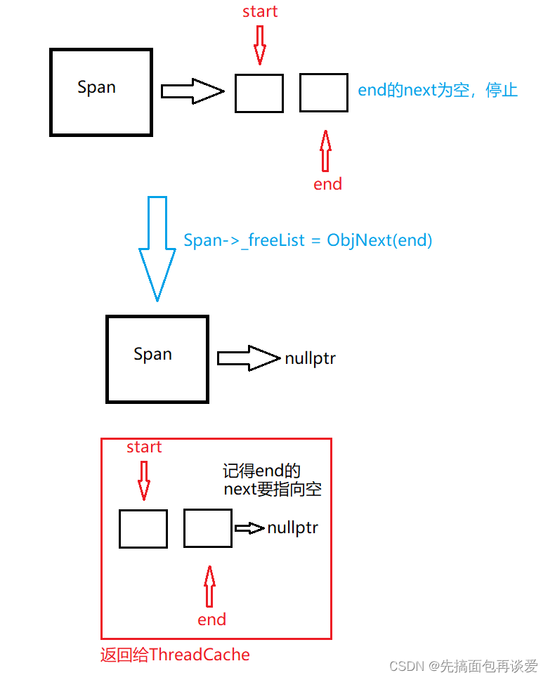
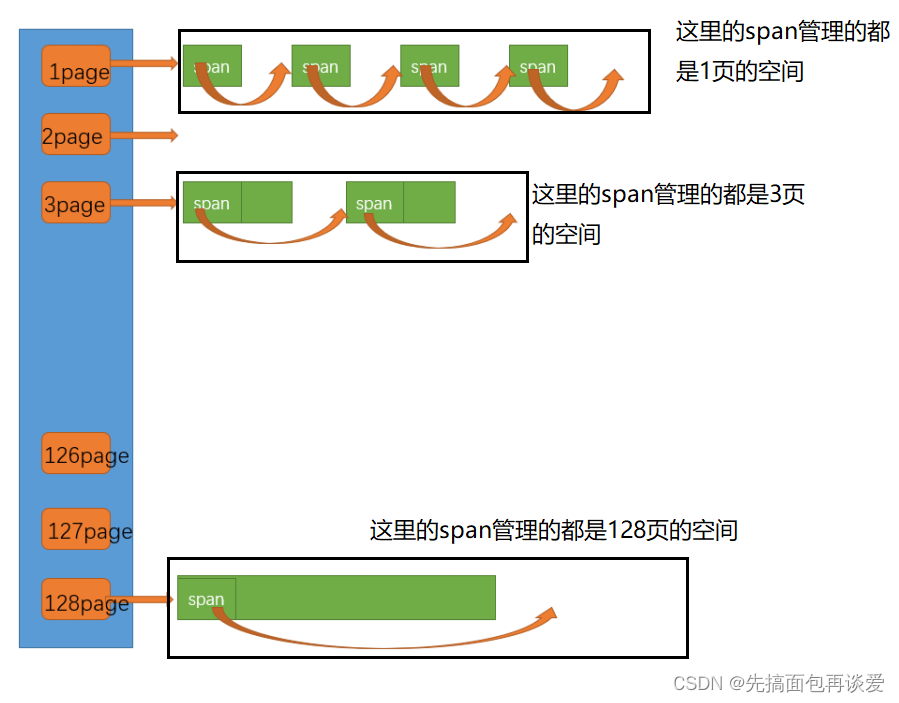
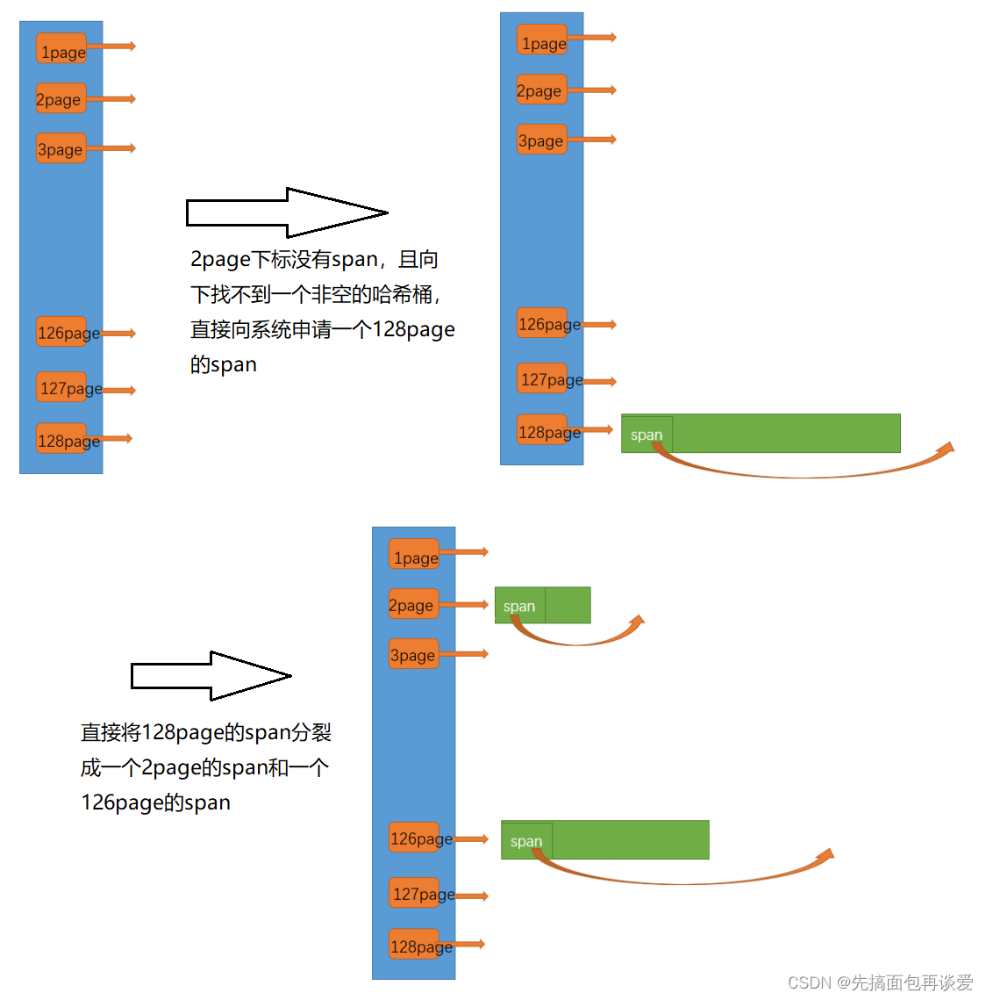
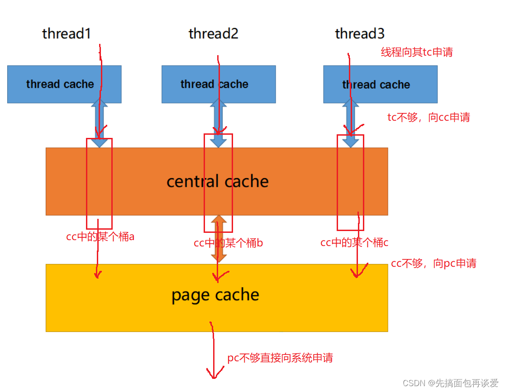

#

## ObjectPool

### 使用char*作为内存池的指针
`char* _memory = nullptr; `

这里不使用`void*`，将 `_memory` 定义为 `char*`，当需要移动 $n$ 个字节时，直接 `_memory += n` 即可，逻辑非常直观。


### 如何分配内存
```c++
//将原本内存池首地址给obj，并将其转为T*指针
//即告诉编译器起始地址为_memory
//长度为sizeof(T)
obj = (T*)_memory; 
_memory += sizeof(T); //内存池指针移动
_remanenetBytes -= sizeof(T);//减少对应可用内存字节
```
指针的存储的是内存块的首地址，而指针的类型决定了编译器从首地址往后读取多少个字节。


### 自由链表回收内存
```c++
void Delete(T* obj)
    { 
        /*        
        在obj指向的内存中，写入一个指针即_freelist
        问题在于obj指向的内存块存放的是T类型的，无法接受指针赋值
        因此这里将obj强制转换为**void(指针的指针)
        让编译器把 obj 指向的内存当作一个“存放指针的容器”
        */
        *(void**)obj = _freelist;
        _freelist = obj;
    }
```


### 从自由链表分配内存
```c++
if(_freelist)
{
    //_freelist不为空则从这里那内存
    //采用头删
    //转为指针的指针再解引用，即以_freelist为首地址读取一个指针，
    //该指针指向的是下一个内存块，将其赋给void* next
    void* next = *(void**)_freelist; 
    obj = (T*)_freelist;
    _freelist = next;
}
```


### 定位new
```c++
//除了分配空间，还得初始化
//定位new。详情见MD
new(obj)T;
```
普通的 new 会做两件事：1. 申请内存；2. 调用构造函数。
但在内存池中，内存是你提前申请好的，你只需要在已有的内存空间上初始化对象。
+ 语法:`new (指针) 类型`;

+ 作用:不分配内存，只在“指针”指向的地址处调用构造函数。

+ new(obj)T; 是完全正确的，它保证了 TreeNode 里的 _val 被设为 0，指针被设为 nullptr。


### 关于内存池（大内存块的释放）


```c++
~ObjectPool()
{
    for (char* ptr : _M)
    {
        free(ptr);
    }
    
}
```
使用vector存放所有的内存池，`std::vector<char*> _M;`，`_M.push_back(_memory);`，在析构函数中循环释放


## Common
### SizeClass
```c++
线程申请size的对齐规则：整体控制在最多10%左右的内碎片浪费
size范围				对齐数				对应哈希桶下标范围
[1,128]					8B 对齐      		freelist[0,16)
[128+1,1024]			16B 对齐  			freelist[16,72)
[1024+1,8*1024]			128B 对齐  			freelist[72,128)
[8*1024+1,64*1024]		1024B 对齐    		freelist[128,184)
[64*1024+1,256*1024]	8*1024B 对齐  		freelist[184,208)
```

实际上这里的对齐数可以理解为步长
在[1,128]这个分为内，每个桶的内存块大小为8，16，24……，按8B增长（因为要入指针，因此最小的是8B）
而在[128_1,1024]这个范围内，每个桶的内存块大小为128+16，128+32，128+48……，按16B增长


## ThreadCache
### TLS-线程局部存储
进程的全局变量是每个线程共享的，那有没有一种全局变量能让某个线程自己独有但是其他线程看不见呢？
答案是有的，就是TLS。
线程局部存储（TLS），是一种变量的存储方法，这个变量在它所在的线程内是全局可访问的，
但是不能被其他线程访问到，这样就保持了数据的线程独立性，避免了一些加锁操作，控制成本更低。
```c++
static thread_local ThreadCache* pTLSThreadCache = nullptr;
```

### FetchFromCentralCache

```c++
void* ThreadCache::Allocate(size_t size)
{
    assert(size <= MAX_BYTES);

    size_t alignSize = SizeClass::RoundUp(size);
    size_t index = SizeClass::Index(size);

    //_freeLists[index]:指定哈希桶
    if(!_freeLists[index].Empty())
    {
        return _freeLists[index].Pop();
    }
    else
    {
        //自由链表为空。向CentralCache申请空间
        return FetchFromCentralCache(index, alignSize);
    }

}
```
需要注意，TC向CC申请空间时，除了给TC自身申请空间，还要返回线程申请的空间，因此需要将span返回的连续内存中，挑出第一块给线程，剩余的给TC自身
```c++ 
//FetchFromCentralCache::
    assert(actualNum >= 1);

    if (actualNum == 1)
    {
        // 如果等于1，那么这个块得直接分配个线程
    }
    else
    {
        // _freeLists[index].Pu
    }
```


## CenteralCache
### CenterCache数据结构


**CC与TC的相同点**
1. CC也是哈希桶，且映射规则与TC一致。这使得当TC某个桶没有空间时可以直接到CC对应小标的哈希桶拿空间

**CC与TC的不同点**
1. 锁：TC由于是TLS，各个线程各自独有，因此线程向TC要空间不产生数据竞争，不用枷锁；CC有“桶锁”，即各个桶有各自的锁，只有多个TC向CC的同一个桶索要空间时，才会发生竞争，需要加锁。

2. TC中自由链表挂的是一个个空间块。CC中挂在的是一个个SPAN。

#### SPAN
1. span管理的是以页（通常为4KB）为单位的大内存块，需要size_t _n去记录管理了多少页？
2. span管理的多个页会被划分为桶对应的字节大小空间，即每个span再挂载自由链表，需要void* _list指向链表头节点

3. 每个桶下挂的span包含的页数不同，桶对应的字节数越大，页数越大，反之越小。由此，span还需要有个_pageID去记录当前span管理的是哪些页

4. span是双向链表，方便增删改查

5. span中还有size_t _usecount。这个_usecount是用来记录当前span分配出去了多少个块空间，分配一块给tc，对应就要`++use_count`，如果tc还回来了一块，那就`--use_count`。_usecount初始值为0。当span中的use_count为0的时候可以将其还给pc以供pc拼接更大的页，用来解决内存碎片问题（外碎片）。

> 为什么需要Span？我猜测单个Span的自由链表是几块连续的页内存，由span去管理一个自由链表是否全部释放，从而回收整片内存。理论上来说，把这些控制信息写在自由链表里应该也行？（或者实际上就可以认为Span是一个自由链表的“头”节点）


### 单例模式与Static
```c++
static CentralCache* GetInstance()
{
    static CentralCache* _sInst;
    return _sInst;
}
```
单例模式已经很熟悉了，这里主要是对于Static的理解：

之前的理解：对局部变量使用static会延长它的寿命，静态局部变量在离开作用域后并不会消亡。

但问题在于代码多次执行到这里，怎么知道静态局部变量是不是已经被创建了？
实际上声明静态局部变量的时候，编译器会自行插入一段“检查-创建”的代码，若变量不存在则创建，若存在则跳过创建，且整个过程是线程安全的。


### FetchRangeObj
```c++
    /**
     * CC给TC分配空间：从指定桶中选取一个非空span，将该span的自由链表给TC
     * @param start [out] 返回的大内存块起始地址
     * @param end [out] 返回的大内存块终止地址
     * @param batchNum [in] TC请求的内存块数量
     * @param size [in] size为TC需要的单块内存块字节数
     * @return actualNum 返回CC实际提供的大小（span可用块数量可能小于TC请求的数量）
     */
    size_t FetchRangeObj(void*& start, void*& end, size_t batchNum, size_t size);
```

```c++
size_t CentralCache::FetchRangeObj(void*& start, void*& end, size_t batchNum, size_t size) {
    size_t index = SizeClass::Index(size);

    // 获取一个非空的span指针，从该span的frreList上取下连续内存块，整个过程加锁
    {
        std::lock_guard<std::mutex> lg(_spanLists[index].mtx);
        Span* span = getOneSpan(_spanLists[index], size);
        assert(span);
        assert(span->_freeList);

        // 选中内存块链表
        // 1. end 向后挪动batchNum-1个位置
        // 2. 如果span可用的块小于batchNum，需提前结束，即Next(end)!=nullptr
        // 3. 需要对end后移的次数计数以返回实际分配的块数量

        start = end = span-> _freeList;
        size_t actualNum = 1;
        while (actualNum < batchNum && ObjNext(end) != nullptr) {
            end = ObjNext(end);
            actualNum++;
        }


        // 将选中的内存块链表从span的freeLsit上断开
        // 1. span的freeList指向next(end)
        // 2. 将next(end)设为nullptr使其与span断开连接即可
        span->_freeList = ObjNext(end);
        ObjNext(end) = nullptr;


        return actualNum;
    }
}
```
**span**的自由链表内存块充足时

**span**的自由链表内存块不足时



## PageCache
### 数据结构
pc中的SpanList则是按span管理的内存页数进行映射的，也就是说第i号桶中挂的span都是i页内存


#### PC给CC分配Span，span的分裂
PC向CC分配以Page为单位的内存，假设分配page=2，则PC检查第2个槽位是否有span，若没有则检查下一个槽位以此类推，直到找到一个span，假设找到了第4个槽位的span，那么就将这个span分裂成2个span，每个span管理2页内存，其中一个span给CC，另一个span则挂在第2个槽位上。若一直到_spanList[128]都没有合适的span，那么就向操作系统申请，假设申请了128页内存，则将这个span分裂成2+126。


#### PC回收CC中的SPAN，span的合并
如果PC收到了CC释放的Span，则依次寻找span所管理的页号的前后页号的页有没有空闲，看是否可以合并，如果合并继续向前寻找。这样就可以将切小的内存合并收缩成大的span，减少内存碎片。

#### PC的全局锁
cc只是对单个桶进行加锁，不是整个cc加锁。当多个线程向其对应tc申请空间的时候，可能出现多个tc同时向cc申请空间，而cc中又可能出现多个桶都没有空间的情况，那么就会有多执行流向pc申请span，但是pc中加的就不是桶锁了，而是对pc整体加锁。


#### PC与CC的Span转换
需要注意的是，PC传递给CC的Span是以页为单位，而CC实际使用的span是以块为单位的，因此需要进行转换。

**size转page** \
当CC的某个size的槽位空掉，会向PC发起申请，但PC管理的内存以page为单位，因此需要将size转为page，以确认从PC的哪个槽位获取span。PC实际给CC分配的内存字节数为该size单次分配的上限，因此只要计算出分配上限，除以单页字节数即可得到页数。
```c++
static size_t NumMovePage(size_t size) {
    size_t n = NumMoveSize(size); // 计算该块在CC中的单次分配上限
    size_t npage = n * size; // 计算单次分配上限的总字节数

    // 这里右移实际上就是除以页大小，即单次分配上限为多少页
    npage >>= PAGE_SHIFT;

    // 这里主要考虑到单次分配总字节数小于一页的情况
    // 此时计算出来的npage为0，强制分配一页
    if (npage == 0) npage == 1;

    return npage;
	}
```

**连续内存转为内存块**\
PC中，span的自由链表为空，使用页号以及页数来管理连续的未划分空间，该span传给CC后，需CC自行划分
## 最初的分配流程
