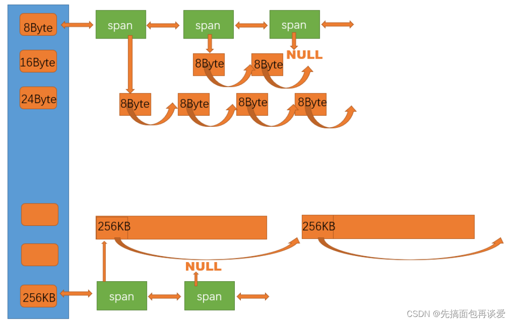

### CenterCache数据结构


**CC与TC的相同点**
1. CC也是哈希桶，且映射规则与TC一致。这使得当TC某个桶没有空间时可以直接到CC对应小标的哈希桶拿空间

**CC与TC的不同点**
1. 锁：TC由于是TLS，各个线程各自独有，因此线程向TC要空间不产生数据竞争，不用枷锁；CC有“桶锁”，即各个桶有各自的锁，只有多个TC向CC的同一个桶索要空间时，才会发生竞争，需要加锁。

2. TC中自由链表挂的是一个个空间块。CC中挂在的是一个个SPAN。

#### SPAN
1. span管理的是以页（通常为4KB）为单位的大内存块，需要size_t _n去记录管理了多少页？
2. span管理的多个页会被划分为桶对应的字节大小空间，即每个span再挂载自由链表，需要void* _list指向链表头节点
TODO:为什么感觉这两个有点重复了？或者说1有点多余？

3. 每个桶下挂的span包含的页数不同，桶对应的字节数越大，页数越大，反之越小。由此，span还需要有个_pageID去记录当前span管理的是哪些页

4. span是双向链表，方便增删改查

5. span中还有size_t _usecount。这个_usecount是用来记录当前span分配出去了多少个块空间，分配一块给tc，对应就要`++use_count`，如果tc还回来了一块，那就`--use_count`。_usecount初始值为0。
当span中的use_count为0的时候可以将其还给pc以供pc拼接更大的页，用来解决内存碎片问题（外碎片）。


### 单例模式与Static
```cpp
static CentralCache* GetInstance()
{
    static CentralCache* _sInst;
    return _sInst;
}
```
单例模式已经很熟悉了，这里主要是对于Static的理解：

之前的理解：对局部变量使用static会延长它的寿命，静态局部变量在离开作用域后并不会消亡。

但问题在于代码多次执行到这里，怎么知道静态局部变量是不是已经被创建了？
实际上声明静态局部变量的时候，编译器会自行插入一段“检查-创建”的代码，若变量不存在则创建，若存在则跳过创建，且整个过程是线程安全的。