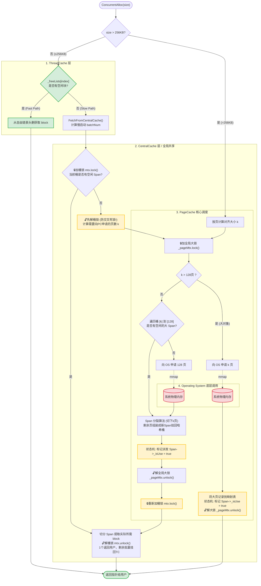
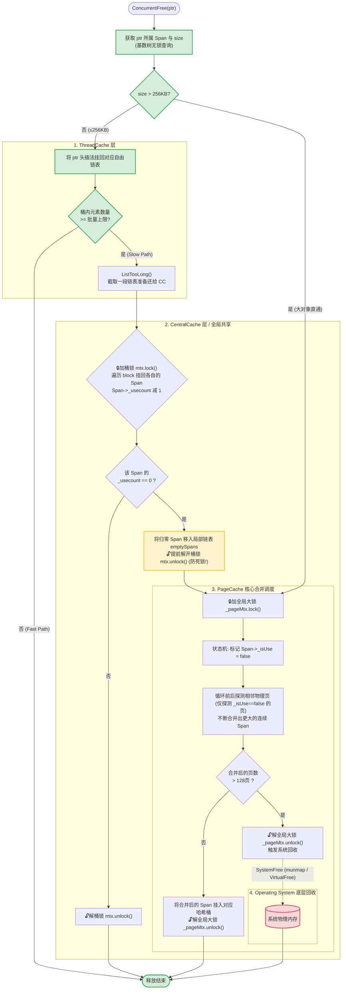

# 高并发内存池 

## 一、 项目简介 (Overview)

本项目是一个基于 C++11 实现的并发内存分配器，其核心设计思想参考了 Google 的开源项目 **TCMalloc** (Thread-Caching Malloc)。

在多线程高并发场景下，频繁调用系统原生的 `malloc/free` 容易引发全局锁竞争，从而影响程序性能，同时也会带来内存碎片化问题。本项目通过引入**三层缓存架构**与**线程局部存储 (TLS)** 技术，将大部分内存分配操作隔离在线程内部完成，从而有效降低了锁竞争的开销。在特定的多线程压测场景下，相较于原生分配器表现出了更为稳定的分配与释放效率。


## 二、 核心架构设计 (Architecture)
1. **ThreadCache (线程私有缓存)**：按块大小划分为多个独立的哈希桶，负责处理 `size <= 256KB` 的小块内存请求。基于 `thread_local` 实现，每个线程独享。分配和释放内存时**无需加锁**。
2. **CentralCache (中心共享缓存)**：作为所有线程的公共内存池，与ThreadCache以相同的方式划分哈希桶，每个哈希桶包含元素为span的双向链表，每个span挂着自由链表。采用**桶锁**，仅在多个线程同时操作同一个桶时才会产生竞争。CentralCache负责页内存和块内存的转换，既需要切分从PageCache获取的连续页内存，又需要将ThreadCache释放的零散块内存组合为页交付给PageCache。
3. **PageCache (全局页缓存)**：以系统页（通常为 8KB）为单位管理大块内存。持有全局大锁，负责向操作系统申请原始物理内存（128页），然后将内存切分为指定页传给CenterCache。在回收到相邻空闲页时进行合并，以缓解内存碎片问题。


## 三、 数据流转解析 (Data Flow)


### 1. 内存申请逻辑 `ConcurrentAlloc(size)`




### 2. 内存释放逻辑 `ConcurrentFree(ptr)`




## 四、 关键技术实现 (Key Implementations)

1. **基数树 (Radix Tree) 的无锁查询**
* **背景**：在释放内存时，需要通过对象地址反查其所属的 `Span`。如果使用传统的 `std::unordered_map`，在高频并发读写时需要加全局锁，容易成为性能瓶颈。
* **实现**：引入 64 位系统下的三层基数树（PageMap）。建立映射时（写操作）由 PageCache 大锁保护；由于树的底层结构静态稳定，硬件可保证指针对齐读写的原子性，因此反查映射时（读操作）实现了**无锁化 (Lock-Free)**，大幅提升了并发释放的效率。


2. **局部链表优化临界区**
* **背景**：CentralCache 向 PageCache 归还 Span 时，如果不提前释放桶锁，容易导致“锁护送”现象。
* **实现**：在 `ReleaseListToSpans` 中使用局部变量 `emptySpans` 暂存需要归还的 Span。提前解除 CentralCache 的桶锁后，再统一获取 PageCache 大锁进行归还。这种设计严格控制了锁的持有时间。


3. **独立的内部对象池 (ObjectPool)**
* **背景**：内存池运行过程中需要管理自身的元数据（如 `Span` 对象），如果依赖原生 `new/delete`，会造成循环调用。
* **实现**：实现了一个基于直接向系统申请大块内存的定长对象池（ObjectPool），专门用于内部元数据的分配，做到了与系统原生分配器的彻底解耦。


## 五、 基准测试 (Benchmarks)

在多线程环境下运行了 `test/benchmark.cpp` 进行基准测试（测试环境已开启 CMake Release 模式及 `-O3` 优化）。

* **测试条件**：8 线程并发，执行 1000 轮次，每轮次动态分配并释放 10000 次大小不一的内存块（模拟内存碎片化场景），总计发生 80,000,000 次分配与释放。

| 分配器类型 | 分配 (Alloc) 耗时 | 释放 (Dealloc) 耗时 | 多线程内部总计耗时 | 挂钟时间 |
| :--- | :---: | :---: | :---: | :---: |
| 系统原生 `malloc/free` | ~3872 ms | ~5543 ms | ~9415 ms | ~1207 ms |
| 本项目 `ConcurrentAlloc` | **~1185 ms** | **~930 ms** | **~2115 ms** | **~270 ms** |

*(注：以上数据受不同 CPU 架构、操作系统缓存状态及编译器优化程度影响，仅供参考。)*

测试结果表明，在持续的高并发小内存分配场景下，该缓存架构能有效减少线程间的阻塞等待，性能相较于原生实现有较明显的改善。


## 六、 编译与运行 (Quick Start)

本项目使用 `CMake` 作为构建系统，在 Linux / macOS / Windows 环境下均可编译。

```bash
# 1. 克隆项目
git clone https://github.com/caoyue2020/MemoryPool.git
cd MemoryPool

# 2. 创建构建目录
mkdir build && cd build

# 3. 配置 CMake (建议使用 Release 模式以确保性能表现)
cmake -DCMAKE_BUILD_TYPE=Release ..

# 4. 编译可执行文件
make -j4

# 5. 运行基准测试程序
./MemoryPool

```

## 七、Reference
https://gitee.com/yjy_fangzhang/memory-pool-project/tree/master/ConcurrentMemoryPool/ConcurrentMemoryPool
